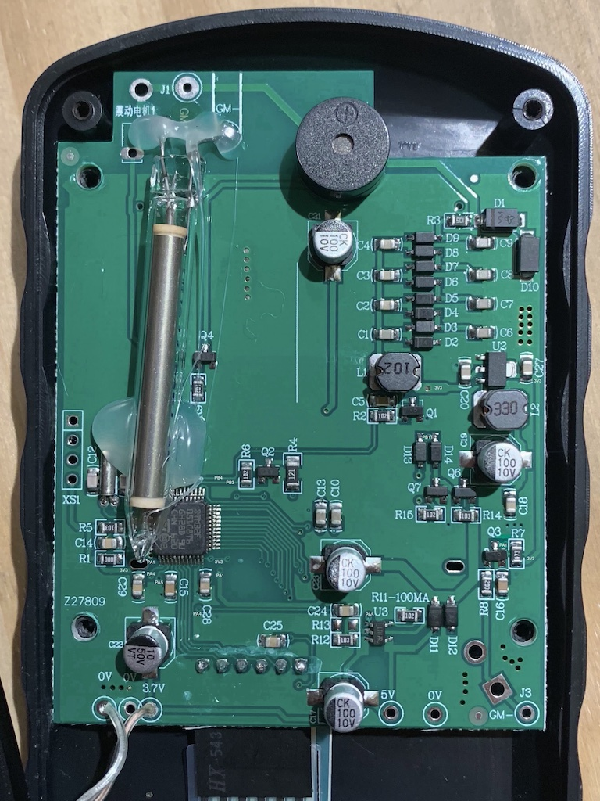

## Overview

FS2011 Pro is a custom firmware for the FS2011/FS2011+ radiation detector/Geiger counter.

Features:

* Instantaneous rate, average rate, dose and history modes.
* Intuitive user interface.
* Measurements in Sievert, rem, cpm and cps.
* Multiple history periods: 2 minute, 10 minute, 1 hour, 6 hour and 24 hour.
* 95% confidence intervals.
* Measurement hold for instantaneous rate, average rate, dose.
* Overload alert.
* Configurable rate and dose alarms.
* Configurable pulse click sounds: off, quiet, loud.
* Configurable backlight timer: off, on for 10 seconds, on for 60 seconds, always on.
* Configurable battery type for battery level.
* Device life statistics.
* 40% longer battery life.
* Power-on self-test and safety watchdog.
* Nuclear chess.

## Installation

__Disclaimer:__ Under no circumstances are the authors responsible or liable in any way for any claims, damages, losses, expenses, costs or liability whatsoever resulting or arising directly or indirectly from the use of this software.

__Notice:__ Installing this software will void the warranty of your device.

### Requirements

* Philips screwdriver
* Soldering iron
* Solder
* 4-pin header
* ST-Link V2 USB dongle (or clone)
* [STM32CubeProgrammer][stlinkv2-link]

### Instructions

* Remove the battery cover and batteries, remove the four screws holding the back case, remove the four screws holding the electronics board on the front case.
* Remove the electronics board and make sure it looks like this (the Geiger-Müller tube might be larger and/or mounted differently):

* If the board doesn't look like this, you probably have a different hardware version and this firmware will most likely break your device.
* Solder the 4-pin header to XS1.
* Optional mod: if the Geiger-Müller tube is mounted vertically like in the previous picture, use a heat gun/glue gun to align the Geiger-Müller tube to the holes of the back case. Be careful, the tube's glass is very delicate.
* Optional mod: apply solder on the battery holder's pads so low-profile AA batteries make good electrical contact.
* Optional mod: increase the volume by drilling a hole on the back case in front of the buzzer.
* Optional mod: add a female USB port and connect GND and +5V to the 0V and 5V pads of the electronics boards. Your FS2011 is now able to run continuously and can even charge Ni-MH batteries.
* Connect the ST-Link V2 device to XS1. Pins from top to bottom are:
  * GND
  * SWCLK
  * SWDIO
  * +3V3
* Before installing FS2011 Pro for the first time, back up the original firmware: open the STM32CubeProgrammer, press the "Connect" button to connect to the ST-Link V2 device, select the "Memory & file editing" view, enter "0x8000000" as "Address" and "0x10000" as "Size", click the read button, click the black triangle on the "Read" button, and select "Save As...".
* Download the latest FS2011 Pro firmware from the [releases][releases-link]: if your Geiger-Müller tube is 48 mm long, download the HH614 firmware; if it is 10.5 mm long, download the M4011 firmware.
* To install FS2011 Pro for the first time: open the STM32CubeProgrammer, press the "Connect" button to connect to the ST-Link V2 device, select the "Erasing & programming" view, check "Full chip erase", choose the firmware/update with the "Browse" button, enter "0x8000000" in "Start address", check both "Verify programming" and "Run after programming", click on "Start automatic mode", wait for the operation to complete, and click on "Stop automatic mode".
* To update FS2011 Pro: open the STM32CubeProgrammer, press the "Connect" button to connect to the ST-Link V2 device, select the "Erasing & programming" view, choose the firmware/update with the "Browse" button, enter "0x8000000" in "Start address", check both "Verify programming" and "Run after programming", and click on "Start Programming".

## Usage

* Long-press the POWER key to turn the device on and off.
* Short-press the POWER key to turn the backlight on (if the backlight is enabled).

* Press the UP and DOWN keys to change the mode/selection.

* Short-press the PLAY/PAUSE key to hold/unhold the current measurement (in instantaneous rate, average rate and dose mode).
* Long-press the PLAY/PAUSE key to reset the mode's measurements.

* Press the MENU/OK key to enter the menu/select a menu option.
* Press the PLAY/PAUSE key to go back from a menu/menu option.

## Measurement

### Instantaneous rate

The instantaneous rate is calculated as the average between a first pulse and the most recent pulse.

If there are more than 11 pulses in 5 seconds, the first pulse is the first one to occur within the 5 second window. Otherwise it is the first one of the most recent 11 pulses.

The 95% confidence intervals assume a constant level of radiation over the averaging period.

### Average rate

The average rate is calculated as the pulse average between the first and last pulse in the time window.

The 95% confidence intervals assume a constant level of radiation over the averaging period.

### Dose

The dose is calculated from the number of pulses in the time window.

### History

The history is calculated from the instantaneous rate, sampled once per second.

## Building

Download [STM32CubeIDE][cubeide-link], open the cubeide folder.

## Thanks

Special thanks to the u8g2 team.

[stlinkv2-link]: https://www.st.com/en/development-tools/stm32cubeprog.html
[cubeide-link]: https://www.st.com/en/development-tools/stm32cubeide.html
[releases-link]: https://github.com/Gissio/fs2011pro/releases
