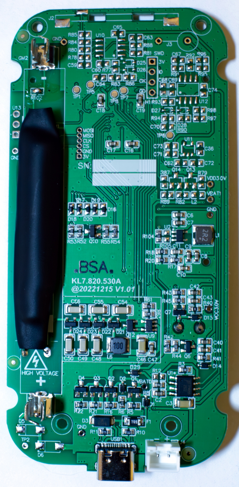
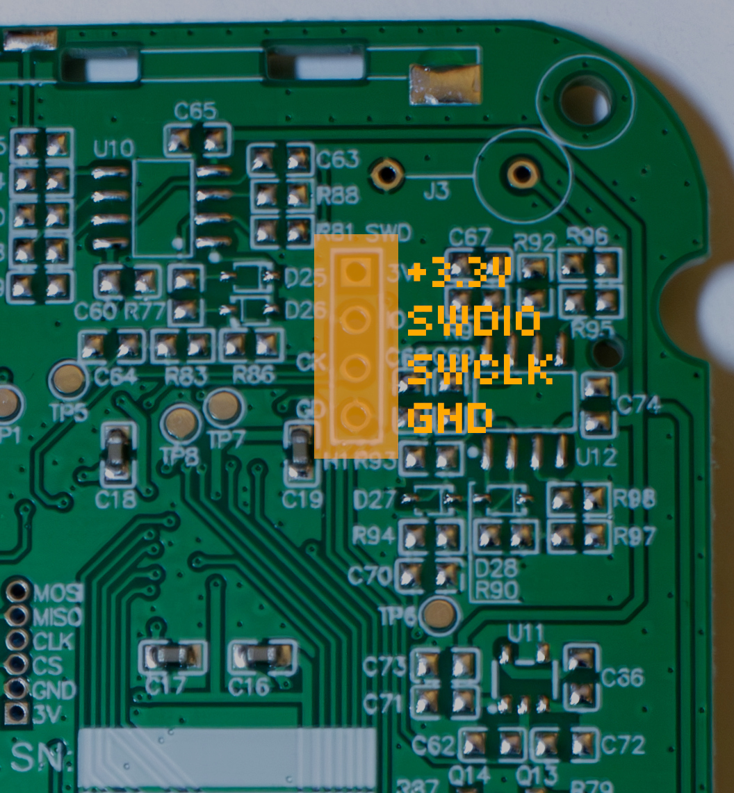

# Installing Rad Pro on the Bosean FS-5000

## Supplies

To install Rad Pro on your Bosean FS-5000 Geiger counter, you will need the following tools and components:

* An [ST-LINK V2 USB dongle (or clone)](https://www.amazon.com/s?k=st-link+v2)
* A 4-pin header
* A Philips screwdriver
* Optional: A soldering iron and solder
* If you use Windows, the [ST-LINK driver](https://www.st.com/en/development-tools/stsw-link009.html).

## Step 1: Open the device

To start installing Rad Pro, turn off the device, remove the screws holding the back case and open the device.

The board should look like in the photo above. If it does not, you may have a different hardware revision. In this case, Rad Pro may not function properly.

If your board looks different and Rad Pro does not work, create an issue on https://github.com/Gissio/radpro/issues.

## Step 2: Connect the programmer

Now, follow these steps:

* Optional: Solder the 4-pin header to the SWD pads of the board.
* If you use Windows, install the [ST-LINK driver](https://www.st.com/en/development-tools/stsw-link009.html).
* Connect the ST-LINK V2 device to the SWD pads. The pins, from top to bottom, are:
  * +3.3V
  * SWDIO
  * SWCLK
  * GND

Make sure the electrical connections are correct. You may break your device if the connections are not correct.

## Step 3: Flash the firmware

Now, download the latest `radpro-flashtool` from the [Rad Pro releases](https://github.com/Gissio/radpro/releases).

* To install from Windows, go to the `bosean` folder and start `bosean-fs5000-[type].bat`.
* To install from macOS or Linux, go to the `bosean` folder and start `bosean-fs5000-[type].sh`.

`[type]` is the type of installation: `install` or `update`. Note that not all releases support updating.

The installation will automatically create a backup of the original firmware in the `backup` folder, so you can recover your device if something goes wrong. Make sure you keep the backups safe, so you can always return to the original firmware. To flash a backup, drag it onto `bosean-fs5000-install.bat` (Windows) or `bosean-fs5000-install.sh` (macOS/Linux).

Before closing the device, take note of the type of Geiger tube: the markings on the glass should be either J321, J305, M4011 or J614. If you have an unmarked tube measuring 55 or 65 mm long, you probably have a J614 or J613 tube, respectively.

## Step 4: Configure your device

Start your device and go to Rad Pro's settings, select “Geiger tube”, “Conversion factor”, and select the option that matches the Geiger-Müller tube installed in your device.

To enable USB data communications under Windows, install the [CH340 driver](https://www.catalog.update.microsoft.com/Search.aspx?q=USB%5CVID_1A86%26PID_7523).

Last, read the [user's manual](../../users.md) for learning how to use Rad Pro.

## Step 5: Getting involved

If you like Rad Pro, consider watching the project to get notified when new releases are out. Also, show your support by starring the project on GitHub.

## Hardware-specific notes

On the FS-5000, the keys are mapped as follows:

  * Power on/off: long hold of the ok/power key.
  * Switch measurement mode: the up/back and down/settings keys.
  * Switch measurement secondary view: the ok/power key.
  * Reset measurement: long hold of the up/back key.
  * Enter settings: short hold of the down/settings key.
  * Go up/down: the up/back and down/settings keys.
  * Select option: short hold of the right/settings key or the ok/power key.
  * Go back: short hold of the up/back key.

On the FS-5000, Rad Pro can store up to 220725 data points. At normal radiation levels (20 cpm), this allows for 4598 days of data at 60-minute intervals, 766 days at 10-minute intervals, 153 days at 1-minute intervals, 25 days at 10-second intervals and 2 days at 1-second intervals.

The FS-5000 does not support HV profiles.
