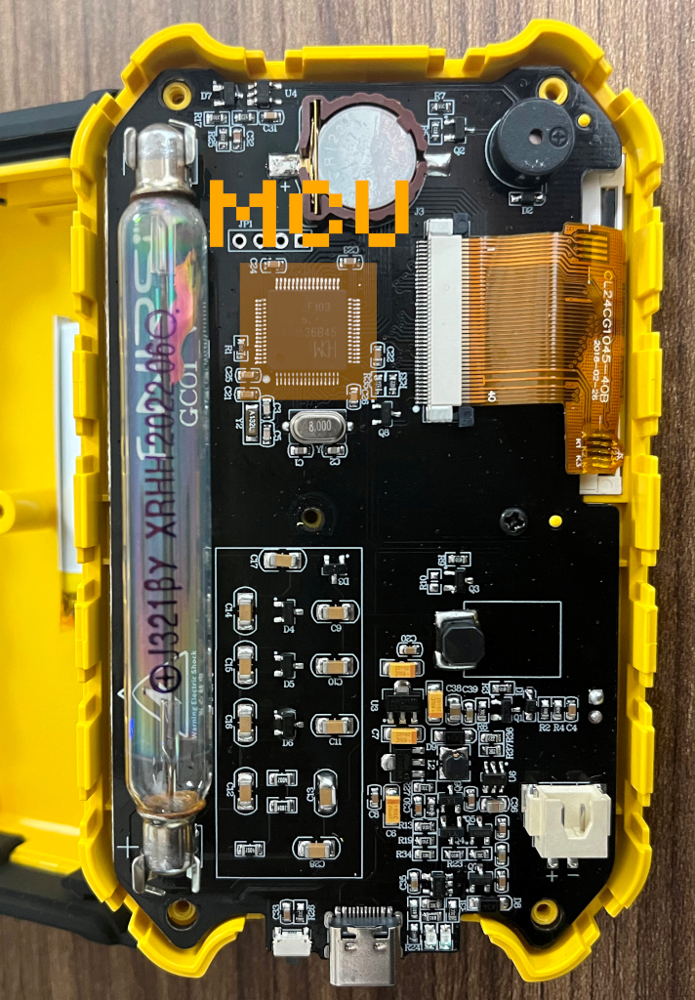

# Installing on the FNIRSI GC-01

## Step 1: Open the device

Follow these steps to start installing Rad Pro on your FNIRSI GC-01:

* Turn off the device.
* Remove the four screws holding the back panel and open the device.
* Take note of the MCU (microprocessor) installed in your device: CH32F103R8T6 (WCH) or APM32F103RBT6 (Geehy). The picture above should help you identify the MCU.
* Also, take note of the type of Geiger tube: the markings on the glass should be either J321 (as in the picture above), J305 or J614. If you have an unmarked tube measuring 55 or 65 mm long, you probably have a J614 or J613 tube, respectively.
* Close the device.

## Step 2: Get the firmware

Download the appropriate firmware from the [Rad Pro releases page](https://github.com/Gissio/radpro/releases):
  * For initial installation, download `radpro-fnirsi-gc01-[MCU]-x.y.z-install.bin`.
  * For updating, download `radpro-fnirsi-gc01-[MCU]-x.y.z-update.bin`.

`[MCU]` is the type of microprocessor on your device: `CH32F103R8T6` or `APM32F103RBT6`.

## Step 3: Flash the firmware

Next:

* Turn off the device.
* Connect the device to your Windows computer using the USB cable. **IMPORTANT**: The installation only works with Windows computers. Do not use macOS or Linux to install Rad Pro.
* Power on the device. A USB drive should become available.
* Drag the firmware file onto the USB drive. The device should restart with Rad Pro installed.

If something goes wrong, open the device again, remove the main battery connector, and connect the device to your computer using the USB cable. You can recover your device with the [original firmware](firmware).

## Step 4: Configure your device

Go to Rad Pro's settings, select "Geiger tube", select "HV Profile" and choose an appropriate HV profile: "Factory default 1" is the profile of the original firmware V0.3 and V1.5, "Factory default 2" is the profile of the original firmware V1.6-2.

Also, within "Geiger tube", select "Conversion factor", and select the option that matches the Geiger-Müller tube installed in your device.

Last, read the [user's manual](../../users.md) for learning how to use Rad Pro.

## Step 5: Getting involved

If you like Rad Pro, consider watching the project to get notified when new releases are out. Also, show your support by starring the project on GitHub.

## Hardware-specific notes

The keys are mapped as follows:

  * Power on/off: long press of the ok/power key.
  * Go up/down: the up and down keys.
  * Hold measurement: the ok/power or left/back key.
  * Reset measurement: long press of the left/back key.
  * Enter settings: the right/settings key.
  * Select option: the ok/power or right/settings key.
  * Bo back: the left/back key.

### FNIRSI GC-01 with a CH32F103R8 (WCH) microprocessor

On the FNIRSI GC-01 with a CH32F103R8 microprocessor, you must enter "USB mode" in the Settings to enable a USB data connection.

Data logging can store up to 5060 data points. At normal radiation levels, this allows for 3 days of data at 1-minute intervals, 8 days at 5-minute intervals, 17 days at 10-minute intervals, 52 days at 30-minute intervals, and 105 days at 60-minute intervals.

The HV profile settings are:

* Factory default (WCH): 9.207 kHz frequency and 75 % duty cycle.

Please do not use the "Factory default (Geehy)" profile with a CH32F103R8 (WCH) microprocessor.

### FNIRSI GC-01 with a APM32F103R8 (Geehy) processor

On the FNIRSI GC-01 with an APM32F103R8 (Geehy) processor, the USB data connection is always available. 

Data logging can store up to 63756 data points. At normal radiation levels, this allows for 44 days of data at 1-minute intervals, 110 days at 5-minute intervals, 221 days at 10-minute intervals, 664 days at 30-minute intervals, and 1328 days at 60-minute intervals.

The HV profile settings are:

* Factory default (Geehy): 47.058 kHz frequency and 50 % duty cycle.

Please do not use the "Factory default (WCH)" profile with a APM32F103R8 (Geehy) microprocessor.
